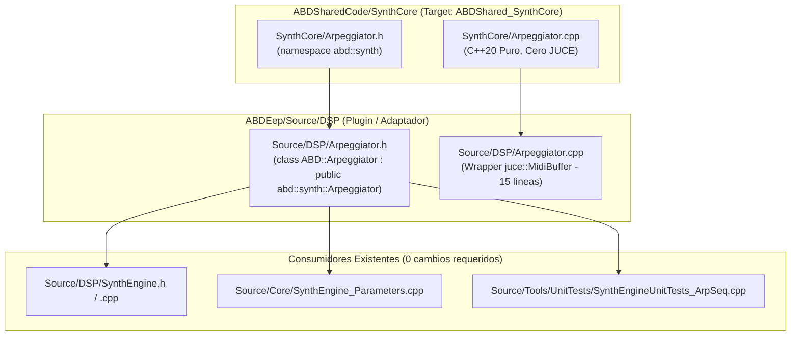

# Hito de Cierre: Arpeggiator Nivel 2 — Promoción a ABDSharedCode y Shim de Compatibilidad

**Fecha:** Octubre 2026  
**Componente:** `SynthCore::Arpeggiator` (Promoción arquitectónica Nivel 2)  
**Estado:** ✅ Consolidado en disco y verificado (160 suites C++, 1.119.736 aserciones, 0 fallos).

---

## 1. Resumen Ejecutivo

En este hito se completó la **promoción a Nivel 2** del arpegiador de ABDEep, extrayendo el núcleo algorítmico completo hacia la biblioteca compartida [ABDSharedCode](file:///d:/desarrollos/ABDSynths/ABDSharedCode) bajo el módulo [SynthCore](file:///d:/desarrollos/ABDSynths/ABDSharedCode/SynthCore) (`namespace abd::synth`).

Simultáneamente, se implementó en `ABDEep` una capa de compatibilidad (shim) basada en herencia pública y reutilización de sobrecargas que preserva al 100% la compatibilidad binaria y de tipos para los consumidores existentes ([SynthEngine](file:///d:/desarrollos/ABDSynths/ABDEep/Source/DSP/SynthEngine.h) y las suites de prueba de arpegio/secuenciador), sin necesidad de modificar una sola línea de código en ellos.

---

## 2. Reparto de Responsabilidades y Ubicación de Archivos



### 2.1 Archivos Canónicos en `ABDSharedCode`
* **[ABDSharedCode/SynthCore/Arpeggiator.h](file:///d:/desarrollos/ABDSynths/ABDSharedCode/SynthCore/Arpeggiator.h):**
  * Espacio de nombres canónico: `namespace abd::synth`.
  * Tipos anidados públicos: `Arpeggiator::HeldNote`, `Arpeggiator::NoteEvent`, `Arpeggiator::FastRng`.
  * Emisión de eventos: Plantilla inline zero-alloc monomorfizada `generate(int numSamples, EventConsumer&& consumeEvent)`.
  * Estado interno `private`: Encapsulación estricta del motor; ningún detalle de buffer o contadores queda expuesto indebidamente.
  * **Cero dependencias de framework:** Libre de JUCE, sin forward declarations de buffers propietarios, compatible de forma nativa con WebAssembly (WASM) y microcontroladores embebidos.
* **[ABDSharedCode/SynthCore/Arpeggiator.cpp](file:///d:/desarrollos/ABDSynths/ABDSharedCode/SynthCore/Arpeggiator.cpp):**
  * Implementación algorítmica pura de los 11 modos de arpegio, cálculo de octavas, swing, gate fraction, orden de pulsación y azar determinista vía `FastRng`.
* **[ABDSharedCode/CMakeLists.txt](file:///d:/desarrollos/ABDSynths/ABDSharedCode/CMakeLists.txt):**
  * Registrado `SynthCore/Arpeggiator.cpp` en el target estático `ABDShared_SynthCore`.

### 2.2 Shim de Compatibilidad en `ABDEep`
* **[ABDEep/Source/DSP/Arpeggiator.h](file:///d:/desarrollos/ABDSynths/ABDEep/Source/DSP/Arpeggiator.h):**
  * Incluye la cabecera compartida mediante `#include "SynthCore/Arpeggiator.h"`.
  * Define `class Arpeggiator : public abd::synth::Arpeggiator` dentro de `namespace ABD`.
  * Importa los constructores de la base con `using abd::synth::Arpeggiator::Arpeggiator;`.
  * **Resolución de Name Hiding:** Utiliza `using abd::synth::Arpeggiator::generate;` para mantener en el mismo conjunto de sobrecargas tanto la plantilla C++20 de la clase base como el overload de JUCE.
  * Declara la sobrecarga de compatibilidad `void generate(juce::MidiBuffer& out, int numSamples);`.
  * Reexporta alias de tipos para preservar compatibilidad con código que asuma `ABD::NoteEvent` o `ABD::FastRng`.
* **[ABDEep/Source/DSP/Arpeggiator.cpp](file:///d:/desarrollos/ABDSynths/ABDEep/Source/DSP/Arpeggiator.cpp):**
  * Reducido a 15 líneas limpias: incluye `<JuceHeader.h>` e implementa el wrapper delegando en `abd::synth::Arpeggiator::generate` transformando cada `NoteEvent` a `juce::MidiMessage`.

---

## 3. Decisiones de Diseño y Contratos Críticos

1. **Ubicación del Wrapper JUCE:**
   * El wrapper con `juce::MidiBuffer` reside estrictamente en el shim de `ABDEep` porque el target `ABDShared_SynthCore` compila sin JUCE. Mantener el wrapper fuera de shared garantiza que los builds WASM y de tests autónomos de `ABDSharedCode` continúen compilando sin arrastrar módulos de JUCE.
2. **Coexistencia de Sobrecargas (Overload Set):**
   * La presencia explícita de `using abd::synth::Arpeggiator::generate;` en la clase derivada es indispensable en C++ para evitar que la declaración de la función con `juce::MidiBuffer` oculte la plantilla `template <typename EventConsumer> generate`.
3. **Ausencia de Política de Modelo en Shared:**
   * `abd::synth::Arpeggiator` no contiene referencias a números de SysEx, mapeos NRPN, ni estructuras de datos de la interfaz de usuario. Todo el motor opera exclusivamente con parámetros normalizados, frecuencias en Hz y tiempos en muestras.

---

## 4. Verificación de Consumidores Intactos

Se comprobó que ninguno de los siguientes archivos necesitó ediciones ni adaptaciones:
* **`Source/DSP/SynthEngine.h`:** Mantiene `#include "Arpeggiator.h"` e instancia `Arpeggiator arpeggiator;`.
* **`Source/Core/SynthEngine_Parameters.cpp`:** Continúa invocando directamente los setters (`setEnabled`, `setMode`, `setStepRateHz`, `setGate`, `setHold`, `setKeySync`, `setOctaves`, `setSwing`).
* **`Source/Tools/UnitTests/SynthEngineUnitTests_ArpSeq.cpp`:** Continúa instanciando `Arpeggiator solo;`, invocando `engine.getArpeggiator()` y llamando a `generate(midiBuffer, n)`.

---

## 5. Certificación en Compilador y Harness

La verificación ejecutada en Release en la máquina local arrojó:

* **Compilación:** MSVC 18 (C++20) enlazó sin advertencias ni conflictos de símbolos entre `ABDShared_SynthCore.lib` y los artefactos de `ABDEep`.
* **Resultados de la Suite C++:**
  ```text
  ===========================================
    Test Summary
  ===========================================
    Total test suites: 160
    Total assertions passed: 1119736
    Total assertions failed: 0
  ===========================================
  ```
