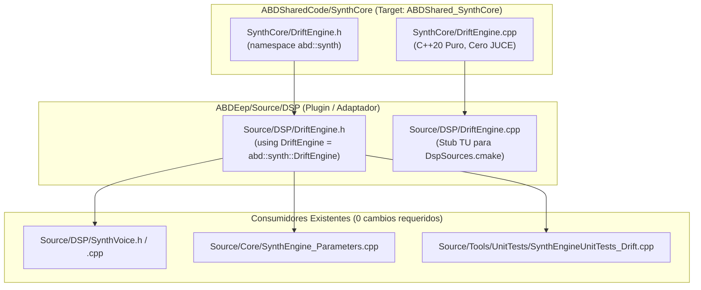

# Hito de Cierre: DriftEngine — Promoción a ABDSharedCode y Shim de Compatibilidad

**Fecha:** Octubre 2026  
**Componente:** `SynthCore::DriftEngine` (Promoción arquitectónica Nivel 2)  
**Estado:** ✅ Consolidado en disco, compilado y verificado (160 suites C++, 1.119.736 aserciones, 0 fallos).

---

## 1. Resumen Ejecutivo

En este hito se completó la **promoción a Nivel 2** del motor de fluctuaciones analógicas (`DriftEngine`) de ABDEep, extrayendo el algoritmo canónico hacia la biblioteca transversal [ABDSharedCode](file:///d:/desarrollos/ABDSynths/ABDSharedCode) bajo el módulo [SynthCore](file:///d:/desarrollos/ABDSynths/ABDSharedCode/SynthCore) (`namespace abd::synth`).

Simultáneamente, se transformó [`ABDEep/Source/DSP/DriftEngine.h`](file:///d:/desarrollos/ABDSynths/ABDEep/Source/DSP/DriftEngine.h) en un shim de compatibilidad mediante alias de tipos (`using DriftEngine = abd::synth::DriftEngine;`), y [`Source/DSP/DriftEngine.cpp`](file:///d:/desarrollos/ABDSynths/ABDEep/Source/DSP/DriftEngine.cpp) en una unidad de traducción mínima de compilación, manteniendo intacta la lista [DspSources.cmake](file:///d:/desarrollos/ABDSynths/ABDEep/DspSources.cmake) tanto para el plugin nativo como para WebAssembly.

---

## 2. Reparto de Responsabilidades y Ubicación de Archivos



### 2.1 Archivos Canónicos en `ABDSharedCode`
* **[`ABDSharedCode/SynthCore/DriftEngine.h`](file:///d:/desarrollos/ABDSynths/ABDSharedCode/SynthCore/DriftEngine.h):**
  * Espacio de nombres canónico: `namespace abd::synth`.
  * Generador de 5 osciladores pseudoaleatorios (*random-walk* browniano suavizado): OSC1 pitch, OSC2 pitch, VCF cutoff, VCF resonancia y tiempos de envolvente.
  * **Cero dependencias de framework:** C++20 estándar (`<cstdint>`, `<cmath>`, `<algorithm>`), libre de JUCE y de asignaciones dinámicas.
* **[`ABDSharedCode/SynthCore/DriftEngine.cpp`](file:///d:/desarrollos/ABDSynths/ABDSharedCode/SynthCore/DriftEngine.cpp):**
  * Implementación física invariante al sample rate: normalización del slew rate frente a `sampleRate`.
  * Generador lineal congruencial (LCG) local de 32 bits determinista, thread-safe y libre de bloqueos.
* **[`ABDSharedCode/CMakeLists.txt`](file:///d:/desarrollos/ABDSynths/ABDSharedCode/CMakeLists.txt):**
  * Registrado `SynthCore/DriftEngine.cpp` en el target estático `ABDShared_SynthCore`.
* **[`ABDSharedCode/docs/DRIFT_ENGINE_INTEGRATION_GUIDE.md`](file:///d:/desarrollos/ABDSynths/ABDSharedCode/docs/DRIFT_ENGINE_INTEGRATION_GUIDE.md):**
  * Manual de referencia completo con fórmulas matemáticas y especificaciones de integración.

### 2.2 Shim de Compatibilidad en `ABDEep`
* **[`ABDEep/Source/DSP/DriftEngine.h`](file:///d:/desarrollos/ABDSynths/ABDEep/Source/DSP/DriftEngine.h):**
  ```cpp
  #pragma once
  #include <SynthCore/DriftEngine.h>

  namespace ABD
  {
      using DriftEngine = abd::synth::DriftEngine;
  }
  ```
* **[`ABDEep/Source/DSP/DriftEngine.cpp`](file:///d:/desarrollos/ABDSynths/ABDEep/Source/DSP/DriftEngine.cpp):**
  * Unidad de traducción stub que incluye `DriftEngine.h`, satisfaciendo la regla de compilación sin duplicar símbolos.

---

## 3. Garantías de Tiempo Real e Invariantes

1. **Zero Allocations en Audio Thread:** El método `nextSample()` opera exclusivamente sobre escalares primitivos preasignados dentro del objeto.
2. **Determinismo LCG:** La semilla local `driftSeed` garantiza reproducibilidad absoluta en pruebas de banco y suites unitarias, sin recurrir al generador global `std::rand()`.
3. **Invarianza de Frecuencia de Muestreo:** El glide aleatorio mantiene la misma constante física de tiempo en segundos independientemente de si el host corre a 44.1 kHz, 96 kHz o 192 kHz.
4. **Comportamiento Determinista a Drift Cero:** Si la amplitud solicitada es $\le 0.0f$, la salida se ancla a $0.0f$ exacto sin residuos flotantes.

---

## 4. Evidencia de Verificación y Cero Regresiones

Ejecución de la suite completa de pruebas unitarias en `ABDEep`:

```text
===========================================
  Test Summary
===========================================
  Total test suites: 160
  Total assertions passed: 1119736
  Total assertions failed: 0
===========================================
```

Tests específicos superados en [`SynthEngineUnitTests_Drift.cpp`](file:///d:/desarrollos/ABDSynths/ABDEep/Source/Tools/UnitTests/SynthEngineUnitTests_Drift.cpp):
* `DriftEngine parameter integration: OK`
* `DriftEngine linear amplitude scaling: OK`
* `DriftEngine setSampleRate recalculates intervals: OK`
* `DriftEngine drift=0 deterministic zero: OK`
* `TST-03 DriftEngine drift0 remains zero across reset and voices: OK`
* `TST-03 DriftEngine amplitude scaling is monotonic: OK`
* `DriftEngine LCG deterministic output (Fix #4): OK`
