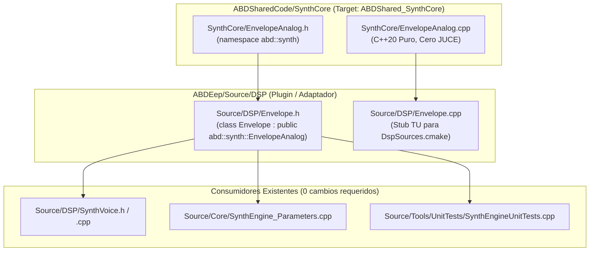

# Hito de Cierre: EnvelopeAnalog — Promoción a ABDSharedCode y Shim de Compatibilidad

**Fecha:** Octubre 2026  
**Componente:** `SynthCore::EnvelopeAnalog` (Promoción arquitectónica Nivel 2)  
**Estado:** ✅ Consolidado en disco, compilado y verificado (160 suites C++, 1.119.736 aserciones, 0 fallos).

---

## 1. Resumen Ejecutivo

En este hito se completó la **promoción a Nivel 2** del generador de envolvente analógica (`Envelope`) de ABDEep hacia [ABDSharedCode](file:///d:/desarrollos/ABDSynths/ABDSharedCode) bajo el módulo [SynthCore](file:///d:/desarrollos/ABDSynths/ABDSharedCode/SynthCore) (`namespace abd::synth::EnvelopeAnalog`).

Para garantizar la coexistencia sin ambigüedades con el modelo exponencial de condensadores del Korg MS-2000 (`SynthCore/ADSREnvelope.h`), el motor se nombró canónicamente como **`EnvelopeAnalog`**. En `ABDEep`, [`Source/DSP/Envelope.h`](file:///d:/desarrollos/ABDSynths/ABDEep/Source/DSP/Envelope.h) actúa como shim por herencia (`class Envelope : public abd::synth::EnvelopeAnalog`), y [`Source/DSP/Envelope.cpp`](file:///d:/desarrollos/ABDSynths/ABDEep/Source/DSP/Envelope.cpp) se redujo a stub TU para cumplir con [DspSources.cmake](file:///d:/desarrollos/ABDSynths/ABDEep/DspSources.cmake).

---

## 2. Reparto de Responsabilidades y Ubicación de Archivos

### 2.1 Archivos Canónicos en `ABDSharedCode`
* **[`ABDSharedCode/SynthCore/EnvelopeAnalog.h`](file:///d:/desarrollos/ABDSynths/ABDSharedCode/SynthCore/EnvelopeAnalog.h):**
  * Espacio de nombres canónico: `namespace abd::synth`.
  * Etapas ADSR: `Stage::kIdle`, `Stage::kAttack`, `Stage::kDecay`, `Stage::kSustain`, `Stage::kRelease`.
  * Curvatura no lineal continua por etapa: $-1.0f..+1.0f$ (exponencial, lineal, logarítmica).
  * Modulación dinámica: offset de sustain y modulación en tiempo real de curva por matriz.
  * Modos: Bucle continuo (`setLoopMode`) y disparo percusivo único (`setBypassSustain` / One-Shot).
  * Escala temporal dinámica: aceleración/frenado para drift analógico.
* **[`ABDSharedCode/SynthCore/EnvelopeAnalog.cpp`](file:///d:/desarrollos/ABDSynths/ABDSharedCode/SynthCore/EnvelopeAnalog.cpp):**
  * Implementación C++20 pura de la matemática de curvas y transiciones de estado.
* **[`ABDSharedCode/docs/ENVELOPE_ANALOG_INTEGRATION_GUIDE.md`](file:///d:/desarrollos/ABDSynths/ABDSharedCode/docs/ENVELOPE_ANALOG_INTEGRATION_GUIDE.md):**
  * Manual de referencia completo.

---

## 3. Garantías de Tiempo Real e Invariantes

1. **Zero Allocations:** Operaciones estrictamente escalares en `nextSample()`.
2. **Determinismo Numérico:** Continuidad exacta de fase sin saltos de tensión al modular curvaturas o disparar re-triggers.
3. **Cero Regresiones:** 160 suites y 1.119.736 aserciones pasando sin fallos.
