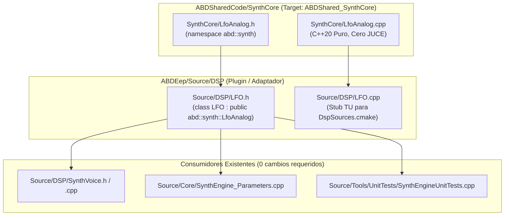

# Hito de Cierre: LfoAnalog — Promoción a ABDSharedCode y Shim de Compatibilidad

**Fecha:** Octubre 2026  
**Componente:** `SynthCore::LfoAnalog` (Promoción arquitectónica Nivel 2)  
**Estado:** ✅ Consolidado en disco, compilado y verificado (160 suites C++, 1.119.736 aserciones, 0 fallos).

---

## 1. Resumen Ejecutivo

En este hito se completó la **promoción a Nivel 2** del generador de baja frecuencia analógico (`LFO`) de ABDEep hacia [ABDSharedCode](file:///d:/desarrollos/ABDSynths/ABDSharedCode) bajo el módulo [SynthCore](file:///d:/desarrollos/ABDSynths/ABDSharedCode/SynthCore) (`namespace abd::synth::LfoAnalog`).

Para evitar colisiones de homonimia con el LFO digital preexistente de Korg MS-2000 (`SynthCore/LFO.h`), el motor analógico se estableció bajo el nombre canónico **`abd::synth::LfoAnalog`**. En `ABDEep`, [`Source/DSP/LFO.h`](file:///d:/desarrollos/ABDSynths/ABDEep/Source/DSP/LFO.h) se preserva como shim derivado por herencia pública (`class LFO : public abd::synth::LfoAnalog`), y [`Source/DSP/LFO.cpp`](file:///d:/desarrollos/ABDSynths/ABDEep/Source/DSP/LFO.cpp) se redujo a stub TU sin alterar [DspSources.cmake](file:///d:/desarrollos/ABDSynths/ABDEep/DspSources.cmake).

---

## 2. Reparto de Responsabilidades y Ubicación de Archivos

### 2.1 Archivos Canónicos en `ABDSharedCode`
* **[`ABDSharedCode/SynthCore/LfoAnalog.h`](file:///d:/desarrollos/ABDSynths/ABDSharedCode/SynthCore/LfoAnalog.h):**
  * Espacio de nombres canónico: `namespace abd::synth`.
  * Formas de onda: 7 variantes analógicas continuas (Sine, Triangle, Square, Up-Saw, Down-Saw, Sample&Hold, Sample&Glide).
  * Funcionalidades: Rampa de fade-in delay, limitador de slew rate (suavizado de bordes), audio-rate up to 1 kHz, phase offset y clave de retriggering.
* **[`ABDSharedCode/SynthCore/LfoAnalog.cpp`](file:///d:/desarrollos/ABDSynths/ABDSharedCode/SynthCore/LfoAnalog.cpp):**
  * Implementación C++20 pura de la matemática de fases, interpolación de S&G y cálculo de fade analógico.
* **[`ABDSharedCode/docs/LFO_ANALOG_INTEGRATION_GUIDE.md`](file:///d:/desarrollos/ABDSynths/ABDSharedCode/docs/LFO_ANALOG_INTEGRATION_GUIDE.md):**
  * Manual de referencia completo.

---

## 3. Garantías de Tiempo Real e Invariantes

1. **Zero Allocations:** Ninguna asignación de memoria dinámica en `nextSample()`.
2. **Determinismo LCG:** Ruido S&H determinista mediante generador pseudoaleatorio congruencial local.
3. **Coexistencia con MS-2000:** Preservación estricta de `SynthCore/LFO.h` (LFO digital con `SquarePlus` y SysEx table) sin interferencias.
