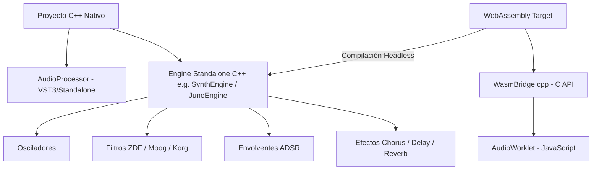

# 📘 Guía Maestra: Compilación de Motores DSP JUCE en WebAssembly (WASM)

Este documento es el **manual estándar de referencia** para adaptar, compilar, asegurar y publicar cualquier sintetizador o efecto basado en C++ / JUCE en la Web utilizando **Emscripten (em++)** y la **Web Audio API (AudioWorklet)**.

---

## 📋 Índice
1. [Requisitos del Entorno e Instalación](#1-requisitos-del-entorno-e-instalación)
2. [El Desafío Técnico de JUCE en Navegadores](#2-el-desafío-técnico-de-juce-en-navegadores)
3. [Arquitectura Estándar de Portabilidad (Patrón Engine Headless)](#3-arquitectura-estándar-de-portabilidad-patrón-engine-headless)
4. [Mapeo y Mocking de Parámetros (`wasm_compat.h`)](#4-mapeo-y-mocking-de-parámetros-wasm_compat-h)
5. [Inyección de Shims y Parches de Hilos](#5-inyección-de-shims-y-parches-de-hilos)
6. [Diseño del Puente C++ / JavaScript (`WasmBridge.cpp`)](#6-diseño-del-puente-c--javascript-wasmbridge-cpp)
7. [Configuración de CMake y Banderas del Enlazador](#7-configuración-de-cmake-y-banderas-del-enlazador)
8. [Integración en Frontend Web (AudioWorklet API)](#8-integración-en-frontend-web-audioworklet-api)
9. [Seguridad, Protección de IP y Domain Locking](#9-seguridad-protección-de-ip-y-domain-locking)
10. [Checklist Paso a Paso para Nuevos Proyectos](#10-checklist-paso-a-paso-para-nuevos-proyectos)

---

## 🛠️ 1. Requisitos del Entorno e Instalación

Para compilar motores JUCE C++ a WASM en Windows, se requiere tener configurado el siguiente software:

### A. Emscripten SDK (`emsdk`)
- **Ruta Estándar Sugerida:** `C:\emsdk`
- **Instalación:**
  ```cmd
  git clone https://github.com/emscripten-core/emsdk.git C:\emsdk
  cd /d C:\emsdk
  emsdk install latest
  emsdk activate latest
  ```

### B. Herramientas de Compilación
- **CMake:** Versión 3.22 o superior (`emcmake cmake`).
- **Build System:** Ninja (`ninja`) o Make.
- **Python & Node.js:** Incluidos automáticamente en el entorno de `emsdk`.

---

## 🤯 2. El Desafío Técnico de JUCE en Navegadores

JUCE es un framework nativo pesado pensado para Windows, macOS y Linux. Al compilar con Emscripten surgen 3 bloqueos críticos:

1. **Dependencias de GUI y Ventanas:** Las clases como `AudioProcessor` arrastran módulos de gráficos y ventanas (`juce_graphics`, `juce_gui_basics`). En WASM, la UI se renderiza con HTML5/CSS3/JS, no con JUCE.
2. **Hilos de Sistema (`ThreadPriorities`):** JUCE asume hilos nativos (`pthread`). En un navegador, el audio corre en un único hilo síncrono ultra-estricto: el **AudioWorkletThread**.
3. **`juce_audio_processors` en Web:** El módulo de JUCE que contiene la APVTS (`AudioProcessorValueTreeState`) falla en WASM por stubs no implementados para plataformas no-DAW.

---

## 🏗️ 3. Arquitectura Estándar de Portabilidad (Patrón Engine Headless)

La estrategia consiste en **separar el motor DSP puro de la clase `AudioProcessor`**:



### Regla de Oro:
> **El motor DSP (`SynthEngine`) no debe incluir componentes de interfaz gráfica nativos ni llamadas a archivos locales de disco.**

---

## 🧩 4. Mapeo y Mocking de Parámetros (`wasm_compat.h`)

Para no modificar una sola línea de lógica DSP de los osciladores ni filtros que leen de un `juce::AudioProcessorValueTreeState`, creamos un **Mock atómico global**.

Este archivo se fuerza en todo el proyecto mediante la bandera `-include wasm_compat.h`:

```cpp
#pragma once
#ifdef __EMSCRIPTEN__

#include <emscripten/emscripten.h>
#include <atomic>
#include <map>
#include <string>
#include <cmath>

namespace juce
{
    class String;

    class RangedAudioParameter {
    public:
        virtual ~RangedAudioParameter() = default;
    };

    struct ParameterID {
        ParameterID() = default;
        ParameterID (const juce::String&, int) {}
        ParameterID (const char*, int) {}
    };

    class AudioParameterChoice : public RangedAudioParameter {
    public:
        AudioParameterChoice() = default;
        template <typename... Args> AudioParameterChoice (Args&&...) {}
        int getIndex() const noexcept { return static_cast<int>(std::round(value.load())); }
        std::atomic<float> value{0.0f};
    };

    class AudioParameterFloat : public RangedAudioParameter {
    public:
        AudioParameterFloat() = default;
        template <typename... Args> AudioParameterFloat (Args&&...) {}
        std::atomic<float> value{0.0f};
    };

    class AudioParameterInt : public RangedAudioParameter {
    public:
        AudioParameterInt() = default;
        template <typename... Args> AudioParameterInt (Args&&...) {}
        std::atomic<float> value{0.0f};
    };

    class AudioParameterBool : public RangedAudioParameter {
    public:
        AudioParameterBool() = default;
        template <typename... Args> AudioParameterBool (Args&&...) {}
        std::atomic<float> value{0.0f};
    };

    class AudioProcessorValueTreeState {
    public:
        struct ParameterLayout {
            template <typename T> void add (T&&) {}
        };
        AudioProcessorValueTreeState() = default;
        std::atomic<float>* getRawParameterValue(const juce::String& id) noexcept;
        RangedAudioParameter* getParameter(const juce::String& id) noexcept;

        std::map<std::string, std::atomic<float>> values;
        std::map<std::string, AudioParameterChoice> choices;
    };
}
#endif
```

---

## 🔧 5. Inyección de Shims y Parches de Hilos

En el script de compilación `wasm/build_wasm.bat`:
1. **Copia local de Módulos:** Se copia `juce_core` a una carpeta local de build (`wasm/juce_shim/juce_core`).
2. **Desactivar ThreadPriorities:** Se parchea `juce_ThreadPriorities_native.h` con funciones vacías (`dummy inline`) para evitar los aborts de Emscripten en tiempo de ejecución.
3. **Stubs Enlazador (`wasm_link_stubs.cpp`):** Se proveen stubs vacíos para funciones del sistema operativo como `juce::File::getSpecialLocation()` o `juce::MessageManager`.

---

## 🔌 6. Diseño del Puente C++ / JavaScript (`WasmBridge.cpp`)

El archivo `WasmBridge.cpp` expone la interfaz C neutra mediante la macro `EMSCRIPTEN_KEEPALIVE`:

```cpp
#include <JuceHeader.h>
#include "Core/SynthEngine.h" // O JunoEngine

static std::unique_ptr<ABD::SynthEngine> gEngine;

extern "C" {

EMSCRIPTEN_KEEPALIVE void wasm_init_engine(float sampleRate, int blockSize) {
    gEngine = std::make_unique<ABD::SynthEngine>();
    gEngine->prepareToPlay(sampleRate, blockSize);
}

EMSCRIPTEN_KEEPALIVE void wasm_process_audio(float* outL, float* outR, int numSamples) {
    if (!gEngine) return;
    gEngine->processAudioBlock(outL, outR, numSamples);
}

EMSCRIPTEN_KEEPALIVE void wasm_set_parameter(const char* paramId, float value) {
    if (!gEngine) return;
    gEngine->setParameter(paramId, value);
}

EMSCRIPTEN_KEEPALIVE void wasm_note_on(int channel, int note, float velocity) {
    if (gEngine) gEngine->noteOn(channel, note, velocity);
}

EMSCRIPTEN_KEEPALIVE void wasm_note_off(int channel, int note, float velocity) {
    if (gEngine) gEngine->noteOff(channel, note, velocity);
}

EMSCRIPTEN_KEEPALIVE void wasm_set_model(int modelIndex) {
    if (gEngine) gEngine->setModel(modelIndex);
}

EMSCRIPTEN_KEEPALIVE void wasm_panic() {
    if (gEngine) gEngine->panic();
}

}
```

---

## ⚙️ 7. Configuración de CMake y Banderas del Enlazador

En `wasm/CMakeLists.txt`:

```cmake
cmake_minimum_required(VERSION 3.22)
project(MySynth_WASM LANGUAGES CXX)

set(CMAKE_CXX_STANDARD 20)

add_executable(mysynth_dsp
    # Fuentes JUCE Headless
    juce_shim/juce_core/juce_core.cpp
    ${JUCE_MODULES}/juce_audio_basics/juce_audio_basics.cpp
    ${JUCE_MODULES}/juce_events/juce_events.cpp
    ${JUCE_MODULES}/juce_data_structures/juce_data_structures.cpp
    ${JUCE_MODULES}/juce_dsp/juce_dsp.cpp

    # Motor DSP Puro
    ${SRC_ROOT}/DSP/SynthEngine.cpp
    ${SRC_ROOT}/Wasm/WasmBridge.cpp
    juce_shim/wasm_link_stubs.cpp
)

target_compile_definitions(mysynth_dsp PRIVATE
    JUCE_MODULE_AVAILABLE_juce_core=1
    JUCE_MODULE_AVAILABLE_juce_audio_basics=1
    JUCE_MODULE_AVAILABLE_juce_dsp=1
    JUCE_MODULE_AVAILABLE_juce_audio_processors=0
    JUCE_MODULE_AVAILABLE_juce_graphics=0
    JUCE_MODULE_AVAILABLE_juce_gui_basics=0
    JUCE_STANDALONE_APPLICATION=0
    __EMSCRIPTEN__=1
    NDEBUG
)

target_compile_options(mysynth_dsp PRIVATE
    "SHELL:-include ${CMAKE_CURRENT_SOURCE_DIR}/juce_shim/wasm_compat.h"
)

set_target_properties(mysynth_dsp PROPERTIES
    SUFFIX ".js"
    LINK_FLAGS "\
        -s WASM=1 \
        -s MODULARIZE=1 \
        -s EXPORT_ES6=1 \
        -s EXPORT_NAME=MySynthDSP \
        -s EXPORTED_FUNCTIONS=[\"_wasm_init_engine\",\"_wasm_process_audio\",\"_wasm_set_parameter\",\"_wasm_note_on\",\"_wasm_note_off\",\"_wasm_set_model\",\"_malloc\",\"_free\"] \
        -s EXPORTED_RUNTIME_METHODS=[\"ccall\",\"cwrap\",\"setValue\",\"getValue\",\"HEAPF32\"] \
        -s ALLOW_MEMORY_GROWTH=1 \
        -s INITIAL_MEMORY=33554432 \
        -s STACK_SIZE=1048576 \
        -s NO_EXIT_RUNTIME=1 \
        -s ENVIRONMENT=web,worker \
        -s ASSERTIONS=0 \
        --strip-all \
        -O3 \
        --no-entry \
    "
)
```

> ⚠️ **Atención:** Utilizar `--strip-all` en lugar de `-s STRIP_ALL=1` para evitar errores en versiones recientes de Emscripten.

---

## 🎧 8. Integración en Frontend Web (AudioWorklet API)

La ejecución del WASM se realiza dentro de un `AudioWorkletProcessor` en un hilo de background:

1. **`dsp-processor.js` (Worklet Thread):**
   ```javascript
   import initModule from './mysynth_dsp.js';

   class DSPProcessor extends AudioWorkletProcessor {
       constructor() {
           super();
           this.port.onmessage = (e) => this.handleMessage(e.data);
       }
       process(inputs, outputs) {
           const output = outputs[0];
           if (this.wasmEngine) {
               this.wasmEngine.processAudio(output[0], output[1], output[0].length);
           }
           return true;
       }
   }
   registerProcessor('dsp-processor', DSPProcessor);
   ```

---

## 🔒 9. Seguridad, Protección de IP y Domain Locking

### A. Imposibilidad de Decompilación C++
- WebAssembly compila el código C++ a bytecode binario anonimizado.
- Las herramientas de decompilación solo obtienen instrucciones neutras (`i32.add`, `f32.mul`). **Es técnicamente imposible recuperar las funciones C++, nombres de clases o algoritmos originales.**
- Tampoco es posible convertir un archivo `.wasm` en un plugin nativo `.vst3` o `.dll`.

### B. Domain Locking (CORS / Restricción de Origen en JS)
Para evitar que un tercero copie tus archivos `.wasm` y los instale en su propio sitio web, añade esta verificación en el arranque de la WebUI (`wasm_bridge_audio.js`):

```javascript
const hostname = window.location.hostname || '';
const isLocal = hostname === 'localhost' || hostname === '127.0.0.1' || hostname === '';
const isAuthorized = isLocal || hostname.endsWith('abdsynths.com') || hostname.endsWith('github.io');

if (!isAuthorized) {
    console.warn('[WasmBridge] Domain Protection: Host no autorizado.');
    // Aplicar silencio o deshabilitar AudioContext
}
```

---

## 📝 10. Checklist Paso a Paso para Nuevos Proyectos

Para portar un nuevo sintetizador C++/JUCE a WASM, sigue estos 6 pasos:

- [ ] **Paso 1:** Asegurar que existe una clase `Engine` desacoplada de `juce::AudioProcessor`.
- [ ] **Paso 2:** Crear la carpeta `wasm/` en la raíz del proyecto y copiar los shims (`wasm_compat.h`, `wasm_link_stubs.cpp`, `JuceHeader.h`).
- [ ] **Paso 3:** Crear `Source/Wasm/WasmBridge.cpp` exponiendo los métodos C (`wasm_init_engine`, `wasm_process_audio`, `wasm_set_parameter`, `wasm_note_on`, etc.).
- [ ] **Paso 4:** Crear `wasm/CMakeLists.txt` con la lista de archivos fuentes DSP puro y flags `--strip-all`.
- [ ] **Paso 5:** Crear el script de build `wasm/build_wasm.bat` para invocar `emcmake cmake` y `ninja`.
- [ ] **Paso 6:** Ejecutar `wasm\build_wasm.bat` desde la consola de Windows y verificar los binarios generados en `WebUI/wasm/`.

---

## 🌐 11. Emulación de UI Nativa y Despliegue en Producción (Vercel / GoDaddy)

Cuando la `WebUI` de un sintetizador nativo (diseñada originalmente para JUCE `WebView2` / `window.juce`) se publica de forma independiente en un servidor web puro (ej: `https://supersix.ajabadia.es`), se debe integrar un **Adaptador de Emulación Standalone (`WebUI/js/wasm_bridge.js`)**:

### A. Adaptador de Emulación Nativa (`window.juce` Mocking)
Para que los componentes de interfaz (Preset Browser, LCD Display, diálogos y menús) funcionen sin backend C++ ejecutable:
1. **Emulación del Preset Browser (`getBrowserData`):** Proveer una lista de presets incrustados en JavaScript (`embeddedPresets`) devueltos de forma asíncrona mediante `Promise.resolve()`.
2. **Navegación de Presets (`loadPreset` / `loadLibraryPreset`):** Al cambiar de preset, el adaptador recorre las claves del objeto preset, las envía al WASM vía `wasm_set_parameter` y sincroniza la UI con `window.syncUI(key, val)`.
3. **Notificación de Eventos (`window.onJuceEvent`):** Notificar eventos como `onBankPatchUpdate` y `onLCDUpdate` para actualizar los displays LED y bezels gráficos.

### B. Despliegue Automatizado en Vercel con Vercel CLI / MCP
Para publicar la carpeta `WebUI/` directamente a un hosting de producción con certificado SSL (HTTPS):
1. **Vincular el proyecto:**
   ```cmd
   npx vercel link --cwd WebUI --project supersix-app --yes --scope tu-equipo-vercel
   ```
2. **Desplegar a producción:**
   ```cmd
   npx vercel deploy WebUI --prod --yes --scope tu-equipo-vercel
   ```

### C. Configuración de Subdominio Personalizado (GoDaddy + Vercel)
1. **Añadir el dominio en Vercel:**
   ```cmd
   npx vercel domains add supersix.ajabadia.es --cwd WebUI --scope tu-equipo-vercel
   ```
2. **Registro DNS CNAME en GoDaddy:**
   - **Tipo:** `CNAME`
   - **Host / Nombre:** `supersix`
   - **Valor / Apunta a:** `cname.vercel-dns.com` (o Servidores NameServers de Vercel `ns1.vercel-dns.com` / `ns2.vercel-dns.com`).

---

## ⚡ 11. Lecciones de Depuración en AudioWorklets (WASM)

Al depurar o portar módulos DSP de JUCE más complejos al contexto de `AudioWorkletProcessor` en WebAssembly, se deben tener presentes las siguientes restricciones:

### A. Crash por inicialización de Entropía (`juce::Random`)
* **Problema**: El constructor por defecto de `juce::Random` (o estáticos como `juce::Random::getSystemRandom()`) intenta leer de `/dev/urandom` o solicitar entropía criptográfica al sistema operativo. En el hilo restringido de `AudioWorklet`, esta llamada lanza una excepción de seguridad no capturable, crasheando el procesador con un error del tipo `libc++abi: terminating` o `RuntimeError: unreachable`.
* **Solución**: Evita instanciar variables miembro o locales de tipo `juce::Random` usando el constructor por defecto. Inicialízalos siempre de forma explícita pasando una semilla numérica fija en la lista de inicialización del constructor (ej: `noiseGen(12345)`).
* **Alternativa de Rendimiento (LFO Sample & Hold)**: Para generadores pseudoaleatorios ligeros en DSP que no requieren criptografía, implementa un generador congruencial lineal (LCG) en línea:
  ```cpp
  // LCG ultra-rápido en coma flotante de rango [-1.0f, 1.0f]
  lcgSeed = lcgSeed * 196314165u + 907633515u;
  float val = (2.f * (float)lcgSeed / (float)0xFFFFFFFFu) - 1.f;
  ```

### B. Mapeos de Parámetros Flotantes Normalizados
* **Problema**: La UI web envía valores de parámetros normalizados en el rango de `0.0` a `1.0`. Si el motor C++ espera enteros discretos (por ejemplo, `polyMode` de `1` a `3`, o `delaySetting` de `0` a `11`), un casteo simple a entero `(int)getMap("param")` truncará el valor flotante y limitará los estados a `0` y `1`, rompiendo la funcionalidad.
* **Solución**: Desnormaliza explícitamente los parámetros en `WasmBridge.cpp` utilizando la escala correcta y redondeando con `std::lround()`:
  ```cpp
  gParams.polyMode = (int)std::lround(getMap("polyMode", 0.0f) * 2.0f) + 1; // 0.0f/0.5f/1.0f -> 1/2/3
  gParams.delaySetting = (int)std::lround(getMap("delaySetting", 0.0f) * 11.0f); // 0.0f..1.0f -> 0..11
  ```

### C. Parcheo del Leak Detector de JUCE
* Al no ejecutarse el ciclo de vida habitual del framework nativo ni instanciarse el `juce::DeletedAtShutdown` en el shutdown de WASM, macros de control de leaks como `JUCE_DECLARE_NON_COPYABLE_WITH_LEAK_DETECTOR` pueden gatillar falsas alertas de fugas de memoria o abortar la ejecución si no se gestionan las instancias de componentes (como `JunoDCO` o `JunoVoice`) dinámicamente o dentro de un wrapper controlado en el Heap C++.

### D. Empaquetado Single-File (Incrustación Base64)
* **Problema**: Los AudioWorklets se ejecutan en un hilo de trabajo aislado con políticas de seguridad restrictivas. Intentar hacer un `fetch()` asíncrono para descargar el binario `.wasm` separado suele provocar fallos de CORS o bloqueos de red en navegadores en entornos de producción rígidos.
* **Práctica de Calidad**: Utilizar la bandera `-s SINGLE_FILE=1` en el enlazador de Emscripten. Esto embebe el binario compilado de WebAssembly en formato Base64 dentro del código JavaScript generado, permitiendo cargar el sintetizador completo con una única importación modular y sin peticiones de red adicionales.

### E. Optimización de Memoria Zero-Copy (Prevención de Garbage Collection)
* **Problema**: Inicializar y desechar vistas en el heap (ej: `new Float32Array(...)`) en cada llamada de la función de callback `process()` genera una gran presión sobre el Garbage Collector de JavaScript, provocando micro-pausas y cortes (pops/clicks) en el audio.
* **Práctica de Calidad**: Obtener y almacenar las referencias a los subarrays del heap (`HEAPF32.subarray(ptr, ptr + samples)`) una única vez durante el arranque o el `prepare`. En el bucle de procesamiento, copiar datos directamente sobre los canales de salida usando métodos de copia directa (`outputBuffer.set(cachedSubarray)`), garantizando un renderizado 100% libre de GC.

### F. Selección de Asignador de Memoria en WASM (`emmalloc`)
* **Práctica de Calidad**: Para aplicaciones de audio en el navegador, sustituir el asignador por defecto por `-s MALLOC=emmalloc`. `emmalloc` está específicamente optimizado para entornos de bajo consumo y tamaño de código mínimo, reduciendo el binario resultante drásticamente y mejorando el perfil de latencia determinista en tiempo de ejecución.


